<div class="middle center">
<div style="width: 100%">

# 基于多视角图片的三维重建

<hr/>

李瀚轩

</div>
</div>

<!--s-->

<div class="middle center">
<div style="width: 100%">

# Part 1.Multi-View Stereo


</div>
</div>

Note:

首先是传统的多视角立体匹配的算法MVS

<!--v-->

## 算法原理
<div class="mul-cols">
<div class='col'>

- 基于多视角图片进行立体匹配，计算深度图。(PatchMatch算法)
  - Initialization
  - Propagation
  - Search
- 从深度图得到三维网格。
  - Poisson Reconstruction
  - Marching Cubes
- 纹理映射。
</div>


</div>

Note:

大家对MVS算法的内容都很熟悉了，这里就不详细展开，老师上课都讲过。大致上就是分为三个步骤：立体匹配得到深度图，从深度图得到三维网格，最后进行纹理映射。其中立体匹配主要使用patchmatch算法，分为随机初始化，相邻图像块的传播，小范围的微调三个步骤。然后我们使用泊松重建从深度图得到三维体素，这个过程首先从深度图还原三维点云，优化体素场。


<!--v-->

## 实现——COLMAP

```
$ colmap feature_extractor --database_path $DATASET_PATH/database.db --image_pat $DATASET_PATH/images

$ colmap exhaustive_matcher --database_path $DATASET_PATH/database.db

$ mkdir $DATASET_PATH/sparse

$ colmap mapper --database_path $DATASET_PATH/database.db --image_path $DATASET_PATH/images --output_path $DATASET_PATH/sparse

$ mkdir $DATASET_PATH/dense

$ colmap image_undistorter --image_path $DATASET_PATH/images --input_path $DATASET_PATH/sparse/0 --output_path $DATASET_PATH/dense --output_type COLMAP --max_image_size 2000

$ colmap patch_match_stereo --workspace_path $DATASET_PATH/dense --workspace_format COLMAP --PatchMatchStereo.geom_consistency true

$ colmap stereo_fusion --workspace_path $DATASET_PATH/dense --workspace_format COLMAP --input_type geometric --output_path $DATASET_PATH/dense/fused.ply

$ colmap poisson_mesher --input_path $DATASET_PATH/dense/fused.ply --output_path $DATASET_PATH/dense/meshed-poisson.ply
```

Note:

然后这个MVS可以通过COLMAP实现，这是具体的操作。

<!--v-->

## 实验结果

- 总体效果符合预期，是COLMAP的正常水平
- 耗时较久
- 总体轮廓清楚，衣服纹理清晰

<div align=center>
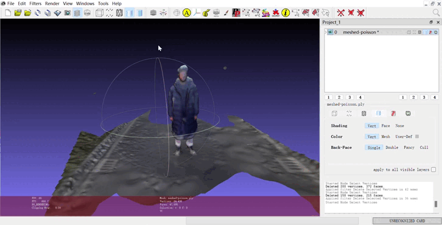
</div>

Note:
到这是使用MVS重建得到的效果demo。总体是符合COLMAP的正常水平的。


<!--v-->
## Summary of MVS

- 存在的问题
  - 光度一致性原理有时候并不满足
  - 对几何结构和纹理的依赖
  - 遮挡问题
  - 计算复杂度

- 需要表现更好的方法——深度学习

Note:

所以现在我们讲完了传统的MVS算法，做一个小总结。
首先MVS立体匹配的假设是光度一致性原理，在patchmatch中我们假设相邻的图像块的像素是相似的。光度一致性在场景明显光照变化，阴影存在的情况下可能不被满足。这其实也体现出了MVS对几何结构和纹理的依赖，以及遮挡问题也会在立体匹配中产生误差。
因此我们需要表现更好的方式来做这个三维场景的工作。

<!--s-->

<div class="middle center">
<div style="width: 100%">

# Part 2. 基于神经表示的重建方案

</div>
</div>

<!--v-->

## Preliminaries

- 通过神经网络从多视角图像中学习场景的三维结构
- Advantages
  - 相比于MVS，能够处理更复杂的三维场景(几何，纹理等)
  - Advanced: 新视角合成，数据压缩，动态场景……

- Disadvantages:
  - 训练时长与计算资源
  - 泛化能力不足，一个模型代表一个场景


- 着重探讨基于三维信息存储结构(编码)对重建质量的影响

Note:
首先我们要知道什么是基于神经表示的重建方案？神经表示，就是用神经网络，因为神经网络可以近似任何一个函数，所以我们可以通过神经网络从多视角图像中学习场景的三维结构。
对于神经表示的方案来说，很明显相比于MVS，它能够处理更复杂的三维场景，这个在后续的工作中也会看到。而且它能完成一些更advanced的工作，比如说新视角合成(NeRF),将场景信息存储在神经网络中，动态场景的重建等等。但是在完成大作业的实现和调研过程中，我也发现了一些比较明显的缺点。首先就是算力，目前极少的算法能够在低算力的条件下得到较高质量的重建结果。另一个就是模型的泛化能力。一个场景只能训练出一个模型。我个人感觉这是未来可能可以提高的方向。
在这次大作业中，我着重探讨三维信息存储结构，即位置编码对重建质量的影响。

<!--v-->

## NeuS

将三维场景隐式存储在神经网络中

一些概念：
- SDF: 零等值面构成三维物体的表面 $f(x)=0$
  - 连续的方式来表示形状

- Volumn rendering: 
  - $C(r)=\int_{t_n}^{t_f}T(t)\sigma (\boldsymbol{r}(t))c(\boldsymbol{r}(t),\boldsymbol{d})dt, T(t)=exp(-\int_{t_n}^{t}\sigma(\boldsymbol{r}(s))ds)$
  - 由NeRF提出

<div align=center>
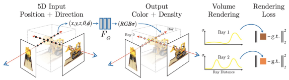
</div>

Note:

首先我们来看NeuS这篇工作，它将三维场景隐式存储在神经网络中。
首先我们需要熟悉一些概念，SDF符号距离场，使用一个零水平集来表示三维物体的表面。另一个是NeRF提出的体渲染，体渲染实际上对每根光线从发出到最后打到图片上的这个过程进行建模，就是为了渲染出图像的RGB颜色值。T是累积透明度，sigma是该点的不透明度。
<!--v-->

## NeuS(continued)

- NeRF的局限
  - 任务是新视角合成，我们的任务是三维表面重建
  - 使用occupancy volumn进行场景表示，几何质量不高
- NeuS的方法：将体渲染应用于学习SDF的表示
  - 使用SDF符号距离场进行三维场景表示
  - 使用体渲染的方法：$C(o,v)=\int_0^{\infty}\omega (t)c(p(t),v)dt$
    - 其中权重$\omega$的性质
      - Unbiased
      - Occlusion-aware
  - 在损失函数中引入ekinoal item,保证表面光滑：
    - $L_{reg}=\frac{1}{mn}\sum_{k,l}(\Vert\nabla f(p_{k,i})\Vert_2-1)^2$

Note:

所以我们现在来看看NeuS的具体方法。在课上老师也讲过NeRF由于使用occupancy volumn来表示场景，因此几何质量不高。在NeuS中作者提出了将体渲染应用于学习SDF的表示。具体而言就是将SDF与颜色联系起来，体现在体渲染公式上的unbiased 和occlusioni-aware, 这两个性质是很直观的，unbiased要求权重在SDF表面达到最大，即贡献最多。occlusion-aware,适应遮挡，即假设一条光线穿过SDF的前后表面，我们希望前表面的贡献更大。这就是具体的方法。然后对于训练的损失函数，NeuS引入了程函损失，即SDF场的梯度为1，这个Loss项更好保证SDF表面光滑。

<!--v-->

## NeuS(experiments)

- 遇到的问题
  - 默认迭代30w次，但是算法5-10w次基本收敛
  - 得到稀疏点云模型后手动剔除不care的点云(otherwise 影响重建效果)
- 效果展示

<div align=center>
<figure class="third">
    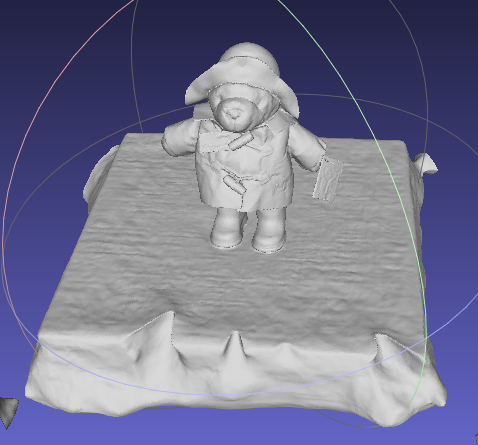
    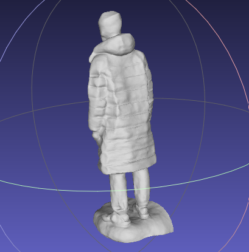
    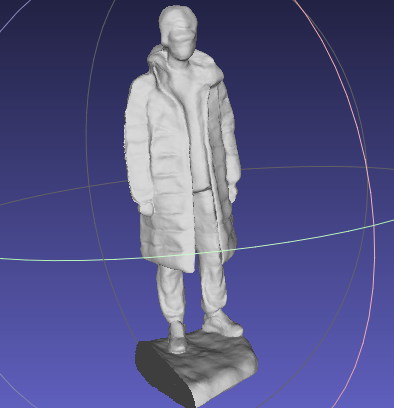
</figure>
</div>

Note:

下面这个是我跑NeuS算法的demo展示，在训练的时候遇到的一些问题就是原文以及代码中都默认迭代30w次，但实际上迭代5-10w次就基本收敛了。另一个问题是我开始训的时候在得到colmap标的数据集后，没有剔除点云，导致区域太大训练效果不好。

<!--v-->
## Summary of NeuS
- Advantages
  - 在中小规模的重建下质量很高
  - 适应具有复杂结构和自遮挡的对象
- Strugglement of current methods
  - 耗时久，泛化性弱
  - 不能很好恢复真实场景的细节
  - 在超大场景重建下表现不佳(will be discussed)
    - 存储和计算资源的限制
    - 数据采样不均匀或不充分，局部or全局？

Note:

现在对NeuS的工作做一个总结。首先相比MVS，它在中小规模的重建质量较高，以及权重的性质确保了该方法适应具有较复杂结构和自遮挡的对象
但是也有不足之处。首先在刚刚提过了，耗时久，泛化性弱，其次它不能很好恢复真实场景中的细节，比如说薄表面。而细节的缺失就使得该方法在超大场景重建中表现很一般。对于数据的采样不能兼得。

<!--v-->

## Neuralangelo——高保真神经表面重建
<div align=center>
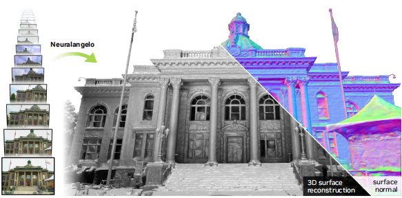
</div>

以高保真度(很好地恢复细节)创造真实场景的虚拟复制品

- 重要的方法
  - 多分辨率哈希网格表示三维场景
  - 神经表面渲染SDF

- 使其实现的关键因素
  - 采用数值方法计算用于平滑操作的高阶导数
  - 在哈希网格上使用粗细优化策略以控制细节

Note:

现在向大家介绍一下这个工作Neuralangelo，高保真神经表面重建。它在超大场景重建中表现很好。该工作运用的两个比较重要方法，一是我们刚刚提到的SDF表示方法，二是使用多分辨率哈希网格来表示三维场景，这里做了数据结构的改进。而使这个方法得以实现的关键因素在于这两个。

<!--v-->
## Multi-resolution hash encoding

使用不同分辨率的网格编码三维点的空间信息

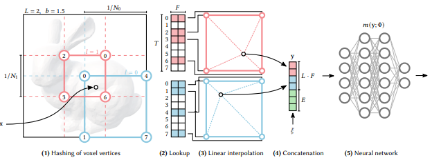

- 设置多分辨率的网格系统
  - coarse: 空间概览
  - fine: 表面细节
- 哈希映射
- 所有分辨率下的特性向量整合，输入到MLP，学习权重

Note:

首先我们来看这个多分辨率哈希网格的编码方式。首先，在三维空间中设置多个分辨率的网格系统。最粗糙的网格提供了最大的空间概览，最详细的网格有助于捕捉物体表面的细节。其次，对于每个输入位置，我们找到其在每个网格分辨率对应的位置，每个网格单元的角点都被映射到一个哈希条目中，存储着编码的特征向量。而所有分辨率下的特征向量加权得到整合的特征向量。

<!--v-->

## Numerical Gradient Computation

Recap: SDF梯度场的ekinoal loss
- Problem: 哈希编码的导数仅在局部voxel连续
- 分析梯度改为数值梯度
  - 允许多个网格的哈希条目同时优化更新


<div align=center>
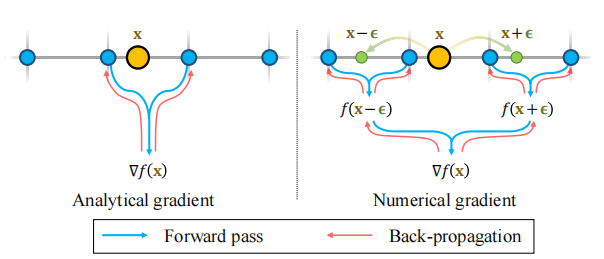
</div>

Note:

在了解了多分辨率哈希编码后，我们就可以来看该篇论文的方法。首先，回顾刚才NeuS的程函损失函数。但是对于哈希网格来说，由于x跨越网格单元边界时，哈希条目发生变化，因此哈希编码的导数并不是全局连续的，仅在局部的voxel里连续。因此在文章中将分析梯度改为数值梯度,如果数值梯度的步长ϵ小于哈希编码的网格大小，则数值梯度等于分析梯度；否则，我们采用多个网格单元的哈希条目参与SDF梯度的计算。

<!--v-->

## Progressive Levels of Details

粗到细的优化策略

- 步长逐渐减小
  - 数值梯度的较大步长对应整体的轮廓
  - 较小的步长避免平滑细节

- 哈希网格分辨率
  - 最初仅启用粗糙哈希网格
  - 根据步长逐步激活更细的网格

<!--v-->

## Neuralangelo(Experiment)

<div align=center>
<figure class="second">
    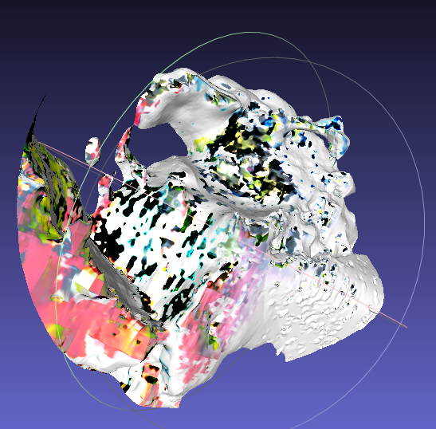
    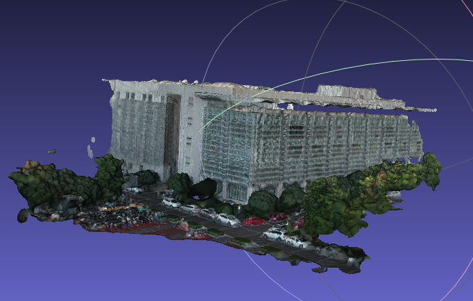
</figure>
</div>

质量差的原因：

- out of memory
- 训练次数不够


<!--v-->

## LoD-NeuS(Preliminaries)

- Recap: strugglement of NeuS
  - 难以准确捕捉高频表面(细粒度的几何细节)
  - 导致模型低保真，几何逼近过度平滑

- Anti-aliased Representation
  - 超采样来解决，耗时

- This paper
  - 三平面位置编码，并优化多尺度特征
  - 可微锥形采样
  - 误差引导采样，促进薄表面的SDF增长

<!--v-->
## Multi-scale Tri-plane Encoding

<div class='mul-cols'>
<div class='col'>

- 可学习的编码方式


- 理解为中心位于原点小正方体


- 每个面包含对应两个维度的特征向量，使用双线性插值


- 一系列不同分辨率(like neuralangelo) coarse to fine


</div>
<div class='col'>
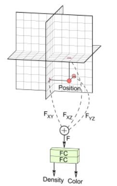
</div>
</div>
Note:

多尺度三平面编码，包含三个可学习的特征平面，对于每个点我们将其投影到三个平面上，形成特征向量。
除此之外，使用类似Neuralangelo的方法，coarse to fine保证不同细节。
至于为什么要使用三平面来表示我理解的不是很透彻，论文上使用三平面是在Multi-convolved 时在每个平面上使用高斯。三平面表示法采用多个正交平面来表示场景，每个平面上包含了不同尺度和方向的信息。这允许模型更好地捕捉场景中的多尺度结构，从而提高对细节的表达能力。
<!--v-->

## Anti-aliasing Rendering of Implicit Surfaces


- Cone Discrete Sampling
  - 传统体渲染不考虑像素的大小和形状
  - 使用视锥离散采样，$W(x,x_0)=exp(-k\Vert x_v-x\Vert)$

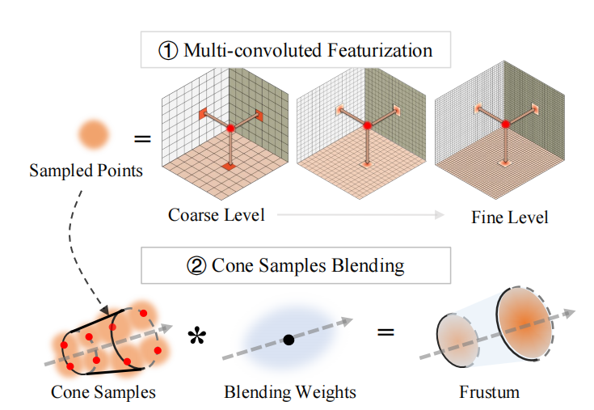

- Multi-convolved Featurization
  - 想要用连续特征近似离散采样
  - 根据tri-plane的分辨率大小选择不同的高斯卷积核
  - 每个分辨率下特征的和：$G_v(x_v)=\cup_{l=1}^{L}G(F_l,\tau)$
  - 最终特征：$Z(x)=\sum_{v=1}^V W(x,x_v)G_v(x_v)$

Note:

在获取了特征后，我们的目标是估计沿着射线的样本SDF以进行体渲染。NeuS将单一射线穿过像素来渲染颜色，不考虑大小和形状，可能导致高频信息的丢失。我们使用锥形定义体渲染。引入锥体离散采样的方法。W代表权重，我们希望离采样点越远贡献越小，这也是符合直观理解的。
<!--v-->

## SDF-Growth Refinement

- 优化符号距离场
- 更好捕获细节(薄表面)
  
<div align=center>
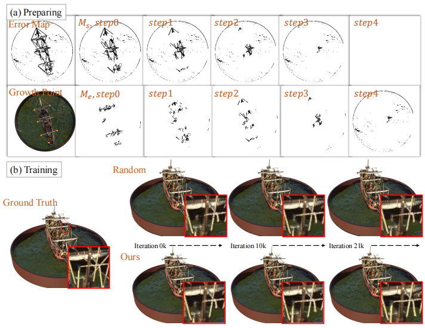
</div>

Note:

SDF表面对于重建薄物体表现不太好： 由于表示薄物体往往需要一个rapid flip, 但是神经网络趋向于学习光滑区域。其次，薄表面被采样到比较少。所以这篇工作里作者提出。
误差感知： 通过在每个训练视点渲染训练好的 SDF，并计算与输入图像的误差图，可以获取每个像素的误差信息。这个误差图表征了 SDF 在重建场景时的偏差情况，尤其是对于细小结构和缺失的区域。

生长区域定义： 通过对误差图进行二值化、膨胀等形态学操作，可以得到一些连通的区域，这些区域反映了图像中 SDF 表现不佳的地方。这些区域被认为是需要进行优化和生长的目标区域。

扩张与交集： 生长策略通过扩张每个区域，使其覆盖更多相关的像素，然后通过与之前的生长区域集合取交集，确保新的生长区域与先前的区域有重叠。这个步骤确保了新的生长区域不会与先前已经指导过的区域冲突，而是对整体场景做出有针对性的贡献。

迭代更新： 通过迭代地执行扩张、交集和更新操作，逐步生成新的生长区域，然后将其添加到训练的掩码列表中。这样，每个生长区域都被用于训练 SDF，以适应图像中不同的结构和特征。

<!--v-->


## Summary

多视图的三维重建：

- 重建质量不断提高：传统位置编码，多分辨率哈希编码，多分辨率三平面表示

前景和展望：

- 探索其它任务有趣的算法：动态场景，重建速度……
- (maybe) 泛化能力？算力？……

学到的东西：

- 优秀的算法，解决问题的方法(MVS,NeuS,Neuralangelo,LoD-NeuS……)
- 技术(ssh,cuda……)
- And more……


<!--s-->

<div class="middle center">
<div style="width: 100%">

# Thank you! Questions?

</div>
</div>